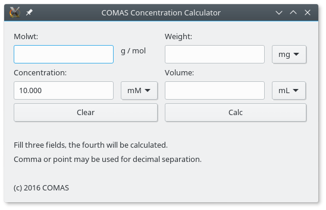
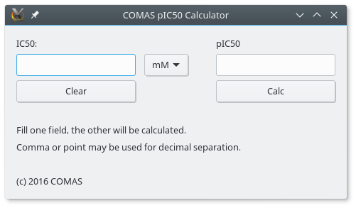

# Lab Tools
## Summary
A set of tool programs written in [Nim](http://nim-lang.org/) (GUI versions use [libui](https://github.com/andlabs/libui) and its [Nim binding](https://github.com/nim-lang/ui)).

* *csv_combine_gui.nim:* select a directory and combine the data
from all CSVs in it into a a single CSV file
* *solution_calc_gui.nim:* calculate concentrations and weights
* *pic50_gui.nim:* calculate pIC50 from IC50 or *vice versa*

*License: MIT*

## Building
Available build options (see `$ nimble tasks`):

### On Linux
To build for Linux: 
`$ nimble releaseLinux`

To build for Windows (this requires `mingw-w64-gcc`, as described [here](https://hookrace.net/blog/writing-a-2d-platform-game-in-nim-with-sdl2/#windows)): 
`$ nimble releaseWin`

### On Windows
I have no toolchain for developing on Windows available,
but something along these lines should work: 
`nim --app:gui -d:release -o:bin/<app-name>.exe c <app-name>_gui.nim`

## Using the GUI versions
For the GUIs to work on Linux, the corresponding `libui.so` library has to be in the library path
(e.g. by putting the information into `/etc/ld.so.conf.d/`).
On Windows, the easiest (and tested) way is probably to distribute the `libui.dll`
alongside with the binary.

## Screenshots
### Linux
 

